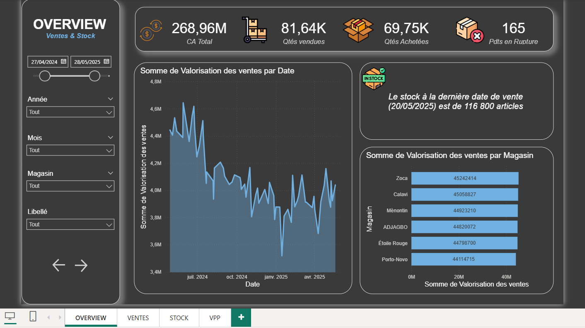

# Power BI – Mockup à 4 pages

Maquette fonctionnelle pour un tableau de bord Ventes & Stocks (Power BI).
Ce repository propose la structure en 4 pages avec objectifs, KPI, visuels et filtres recommandés.

---

## Sommaire
- Page 1 – Overview (Vue d’ensemble)
- Page 2 – Analyse Stock
- Page 3 – Analyse Ventes
- Page 4 – Stratégie & Scénarios
- Points forts
- Mise en route (optionnel)

---

## Page 1 – Overview (Vue d’ensemble)

Objectif : donner une vision globale de la performance.

### KPI (haut de page)
- CA Total
- Quantités vendues
- Stock total actuel
- Taux de rupture (%)
- Marge brute (si disponible)

### Visuels centraux
- Courbe CA et Quantités vendues — évolution mensuelle
- CA par magasin — histogramme comparatif
- Top 10 produits par CA — barres horizontales
- Carte géographique des magasins avec CA total

### Filtres (Slicers)
- Année / Mois
- Magasin
- Famille de produits

---

## Page 2 – Analyse Stock

Objectif : suivre l’état des stocks et détecter les ruptures.

### KPI
- Stock global actuel
- Produits en rupture
- Produits sous seuil de sécurité (si seuil défini)

### Visuels centraux
- Stock par magasin — colonnes
- Stock par produit — barres horizontales (tri par stock croissant)
- Tableau “Produits en alerte” (Référence, Magasin, Stock réel, Écart)
- Comparatif Stock théorique vs Stock réel — jauge ou bar chart

### Filtres (Slicers)
- Magasin
- Catégorie de produit
- Période

---

## Page 3 – Analyse Ventes

Objectif : comprendre la dynamique des ventes.

### KPI
- CA total
- Quantités vendues
- Ticket moyen (CA ÷ ventes)

### Visuels centraux
- Évolution des ventes par jour/semaine — courbe
- CA par produit — bar chart
- CA par canal / magasin — colonnes empilées
- Top 10 produits vendus — barres horizontales
- Tableau détail ventes (Date, Magasin, Produit, Quantités, CA)

### Filtres (Slicers)
- Période
- Magasin
- Famille / Produit

---

## Page 4 – Stratégie & Scénarios

Objectif : simuler et anticiper.

### KPI (scénario choisi)
- Impact CA
- Impact stock
- Taux de rupture estimé

### Visuels centraux
- Paramètres de simulation (What-if) : croissance des ventes (%), variation des achats (%), seuils de sécurité par produit
- Impact attendu sur les stocks par magasin (avant/après)
- Impact attendu sur le CA (avant/après)
- Scénario optimiste / pessimiste / neutre — comparatif
- Plan d’action suggéré (ex. augmenter achats de ciment, réduire stock dormant de peinture)

---

## Points forts de ce mockup
- Page 1 : tableau de bord exécutif (KPI et vision globale)
- Page 2 : pilotage opérationnel des stocks
- Page 3 : analyse détaillée des ventes
- Page 4 : outil de prospective pour la direction

---

## Mise en route (optionnel)
Vous pouvez implémenter ce mockup dans Power BI en :
1. Connectant vos données (fichiers Excel, base SQL, etc.).
2. Créant les mesures DAX CA, Quantités, Stock réel, Taux de rupture, Ticket moyen, etc.
3. Ajoutant des Segments (Slicers) pour la navigation par Période / Magasin / Produit.
4. (Facultatif) Ajoutant des Paramètres What-if pour la page “Stratégie & Scénarios”.

Pour accélérer, vous pouvez partir d’un starter pack contenant scripts Power Query, mesures DAX et thème.
